# Network Traffic Analysis with Wireshark

## Overview

This project documents a hands-on network traffic analysis performed using Wireshark. I captured live network traffic from my Windows system and analyzed DNS resolution, IP communication, QUIC/HTTPS traffic, TCP connection attempts, protocol distribution, network conversations, and TCP retransmissions.

The objective was to practice a structured network investigation similar to the initial analysis performed by a SOC analyst when reviewing network activity.

## Tools & Technologies

- Wireshark
- Windows
- DNS
- IPv4
- TCP
- UDP
- TLS
- QUIC / HTTPS

## Investigation Objectives

The investigation focused on:

- Capturing live network traffic
- Using Wireshark display filters
- Identifying DNS queries and responses
- Following a domain from DNS resolution to IP communication
- Identifying source and destination IP addresses
- Examining UDP/443 and QUIC traffic
- Reviewing TCP connection attempts
- Identifying TCP retransmissions
- Reviewing active network conversations
- Analyzing protocol distribution
- Distinguishing observations from conclusions

---

# Investigation

## 1. DNS Resolution Analysis

I first filtered the packet capture for DNS traffic associated with `example.com`.

Filter used:

`dns.qry.name contains "example.com"`

The capture showed DNS queries from the local host `192.168.1.207` to the DNS resolver `192.168.1.1`.

The DNS responses returned multiple addresses, including:

- `172.66.147.243`
- `104.20.23.154`

This demonstrated the first stage of the connection: resolving a human-readable domain name to IP addresses that can be used for network communication.

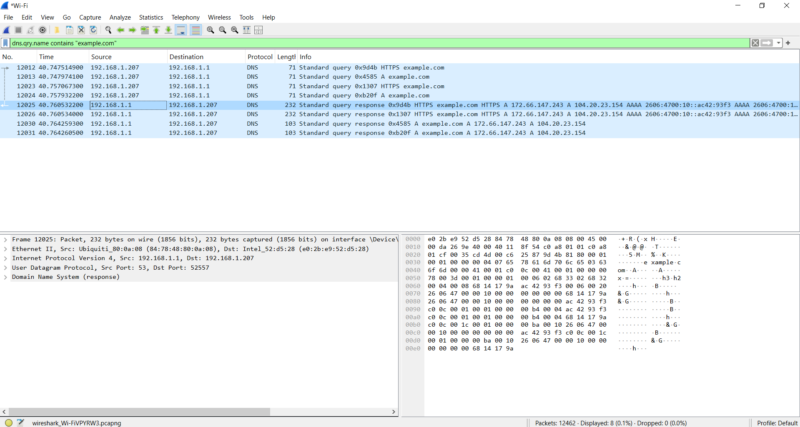

---

## 2. Following the Resolved IP Address

After identifying `172.66.147.243` in the DNS response, I filtered the capture for traffic involving that address.

Filter used:

`ip.addr == 172.66.147.243`

This allowed me to correlate the DNS resolution with subsequent communication between the local system and the resolved external IP address.

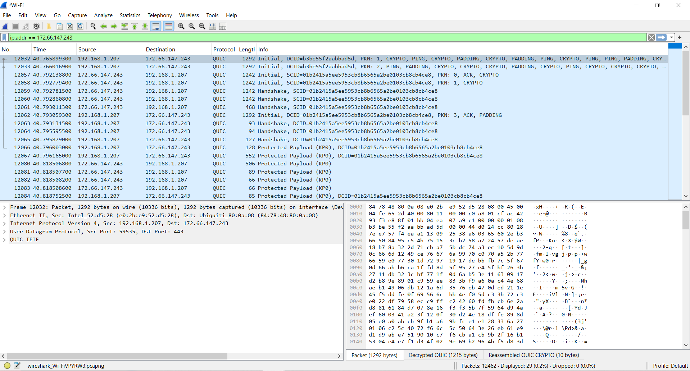

This is a useful investigation technique because an analyst can move from a domain observed in DNS logs to the actual network communication associated with the resolved infrastructure.

---

## 3. QUIC Traffic Analysis

I narrowed the previous results further by filtering for QUIC traffic involving the resolved IP.

Filter used:

`ip.addr == 172.66.147.243 && quic`

The packets showed QUIC Initial packets, handshake traffic, acknowledgements, and protected payloads.

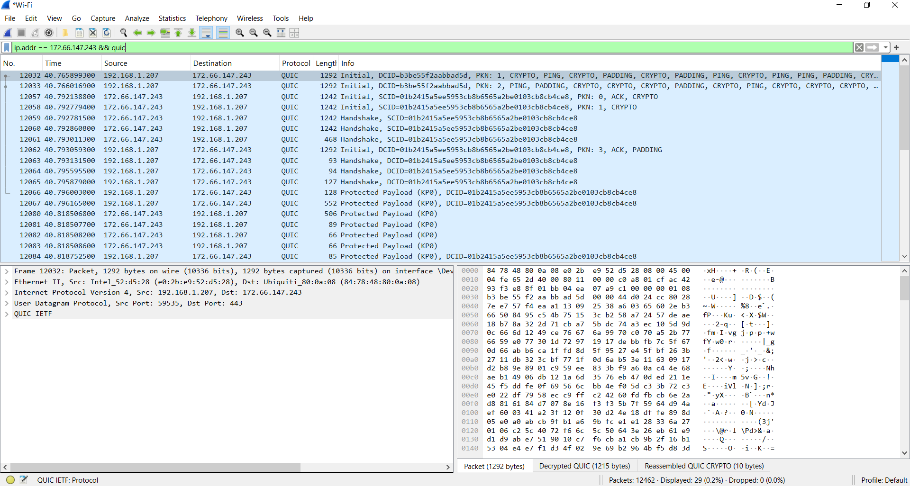

Packet details showed communication using UDP with destination port `443`.

QUIC provides encrypted web communication over UDP. Although the application payload is protected, network metadata such as IP addresses, ports, packet sizes, timing, and communication direction remains useful during an investigation.

---

## 4. Google DNS Resolution

To repeat the workflow with another destination, I analyzed DNS activity for `www.google.com`.

Filter used:

`dns.qry.name == "www.google.com"`

The capture showed DNS queries from `192.168.1.207` to `192.168.1.1` and responses containing several Google IP addresses.

One observed address was:

`142.251.157.119`

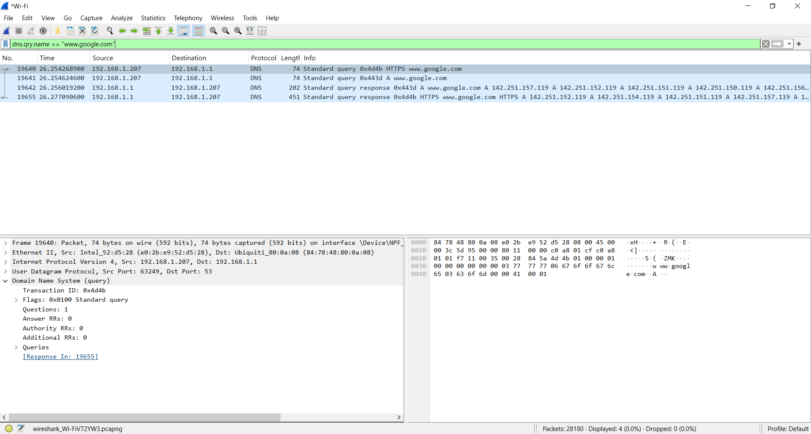

This provided another example of correlating a DNS request with later network activity.

---

## 5. Google QUIC Communication

I then filtered the capture for traffic involving `142.251.157.119`.

Filter used:

`ip.addr == 142.251.157.119`

The resulting packets showed QUIC communication between the local host and the external Google IP address.

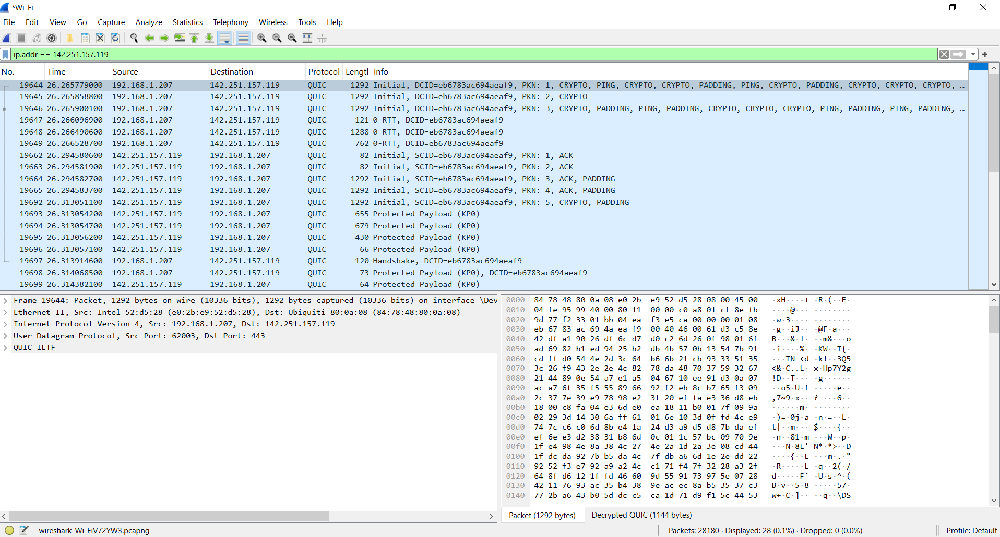

Packet details again showed UDP communication using destination port `443`, demonstrating modern encrypted web traffic using QUIC.

---

# Traffic Statistics

## 6. IPv4 Endpoint Analysis

Wireshark's IPv4 statistics were used to review addresses observed during the capture.

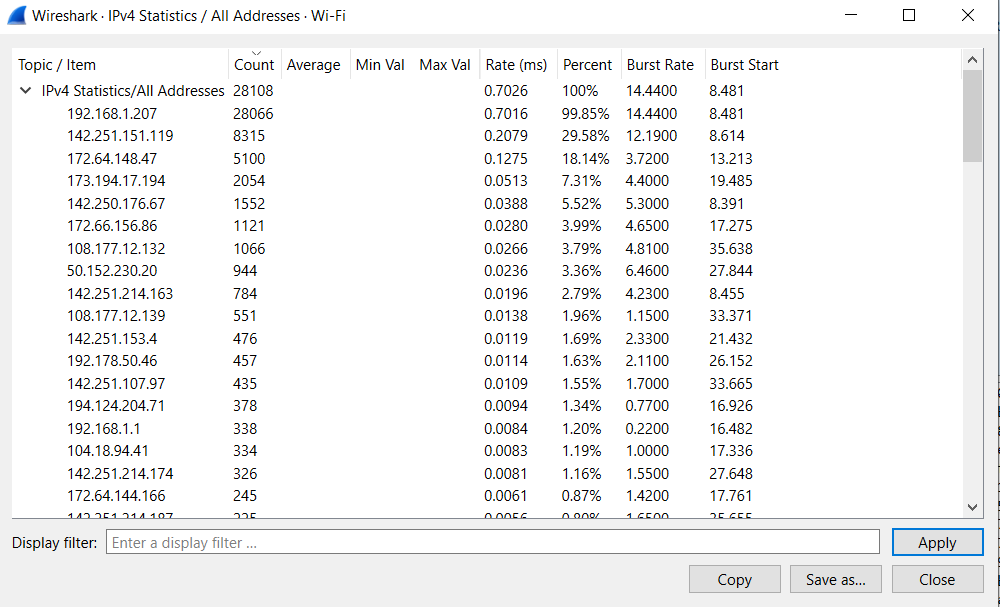

The local host `192.168.1.207` appeared extensively throughout the capture along with numerous external addresses.

Endpoint statistics can help an analyst identify systems generating significant traffic and determine which external hosts may require additional investigation.

---

## 7. Network Conversations

The Conversations view was used to examine communication pairs observed during the capture.

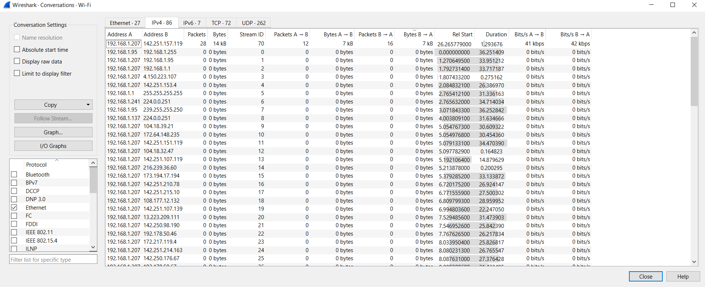

This view provides information such as:

- Address A and Address B
- Packet counts
- Bytes transferred
- Traffic direction
- Connection duration
- Transfer rates

Conversation statistics can help identify which systems communicated and how much traffic was exchanged.

---

## 8. Protocol Hierarchy

I reviewed the Protocol Hierarchy Statistics to understand the overall composition of the captured traffic.

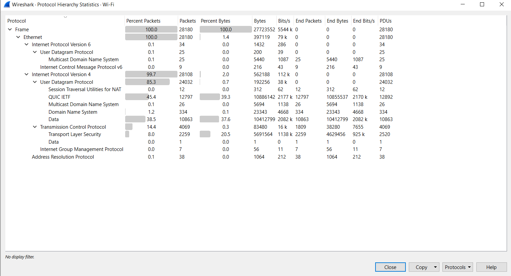

The capture contained traffic including:

- IPv4
- IPv6
- UDP
- TCP
- DNS
- QUIC
- TLS

A significant portion of the capture used UDP and QUIC, which was consistent with the encrypted web traffic observed during the investigation.

---

# Additional Traffic Analysis

## 9. DNS Queries Generated by the Host

To identify DNS queries generated by the local system, I used:

`dns.flags.response == 0 && ip.src == 192.168.1.207`

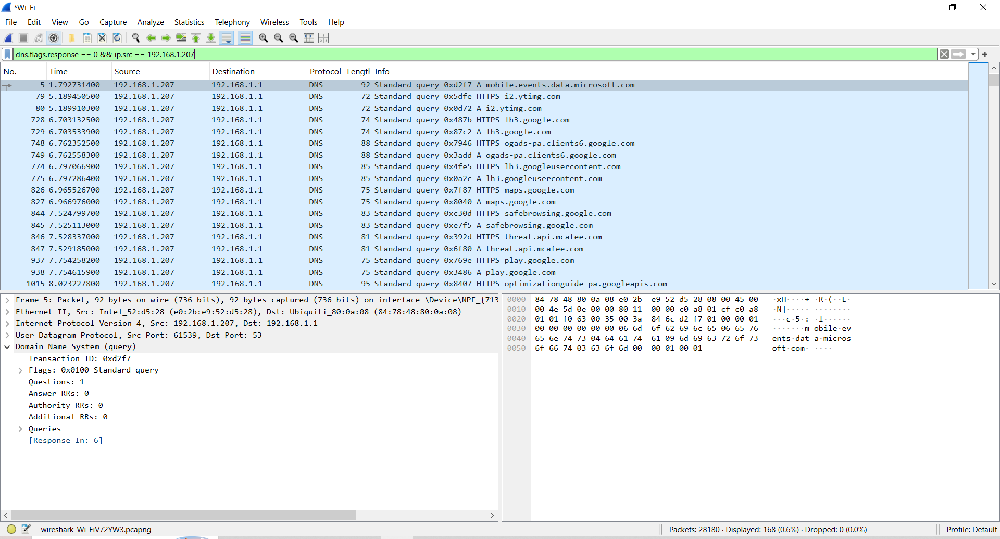

This isolated DNS requests originating from the host and showed requests for multiple domains and services.

Reviewing outbound DNS queries can be valuable during security investigations because unusual or unexpected domain requests may provide indicators of suspicious activity.

---

## 10. TCP SYN Connection Attempts

I filtered for initial TCP SYN packets using:

`tcp.flags.syn == 1 && tcp.flags.ack == 0`

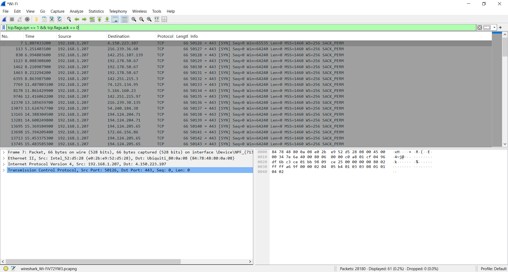

This isolated new TCP connection attempts initiated by the local host.

The capture showed connections to multiple external IP addresses, frequently using destination port `443`.

Filtering initial SYN packets can help an analyst identify connection attempts without reviewing every packet in a TCP session.

---

## 11. TCP Retransmission Analysis

Finally, I searched for TCP retransmissions using:

`tcp.analysis.retransmission`

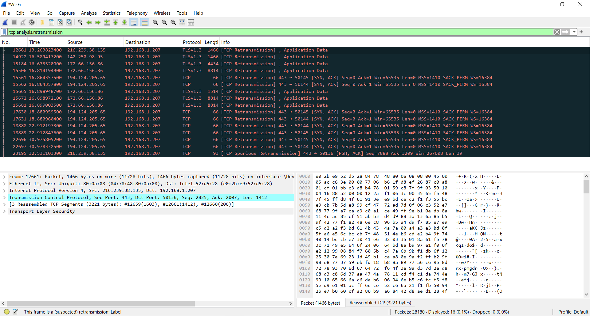

Several retransmitted packets were observed.

TCP retransmissions can occur because of packet loss, network congestion, latency, or other connectivity conditions. Their presence alone does not indicate malicious activity.

In a real investigation, unusually high retransmission rates or repeated connection problems could justify additional analysis.

---

# Key Findings

The investigation demonstrated a complete basic network-analysis workflow:

**DNS query → DNS response → resolved IP address → network connection → protocol analysis**

The capture showed normal examples of DNS resolution followed by encrypted web communication using QUIC and HTTPS-related traffic.

Important observations included:

- DNS queries originated from the local host.
- DNS responses provided external IP addresses.
- Resolved IP addresses could be correlated with subsequent network traffic.
- QUIC communication used UDP port 443.
- TCP SYN filtering revealed new TCP connection attempts.
- TCP retransmissions were present but are not inherently malicious.
- Wireshark statistics provided broader visibility into endpoints, conversations, and protocols.

No malicious activity was confirmed during this lab.

---

# SOC Analyst Investigation Approach

If similar traffic appeared during a real security alert, I would correlate the packet capture with additional telemetry before determining whether the activity was malicious.

Additional investigation could include:

- Checking domain and IP reputation
- Reviewing SIEM alerts
- Reviewing firewall and DNS logs
- Checking endpoint telemetry
- Identifying the process responsible for the connection
- Reviewing authentication and user activity
- Comparing activity with known Indicators of Compromise (IOCs)
- Escalating suspicious findings according to incident response procedures

This is important because network traffic should be evaluated in context rather than treating an individual packet, connection, or retransmission as proof of malicious activity.

---

# Skills Demonstrated

- Wireshark packet analysis
- Network traffic filtering
- DNS analysis
- IP address correlation
- TCP/IP fundamentals
- UDP analysis
- QUIC traffic identification
- TCP SYN analysis
- TCP retransmission analysis
- Endpoint analysis
- Network conversation analysis
- Protocol hierarchy analysis
- Basic SOC investigation methodology
- Security documentation

---

# Conclusion

This lab strengthened my understanding of how DNS resolution leads to network communication and how Wireshark can be used to investigate activity at the packet level.

The exercise also demonstrated how an analyst can move from a broad packet capture to specific evidence by applying filters, correlating DNS results with IP traffic, examining protocols, and reviewing network statistics.

This project is part of my ongoing hands-on training for entry-level SOC and cybersecurity analyst roles.

---

## Disclaimer

This analysis was performed in a controlled lab environment using traffic generated from my own system for educational purposes.
